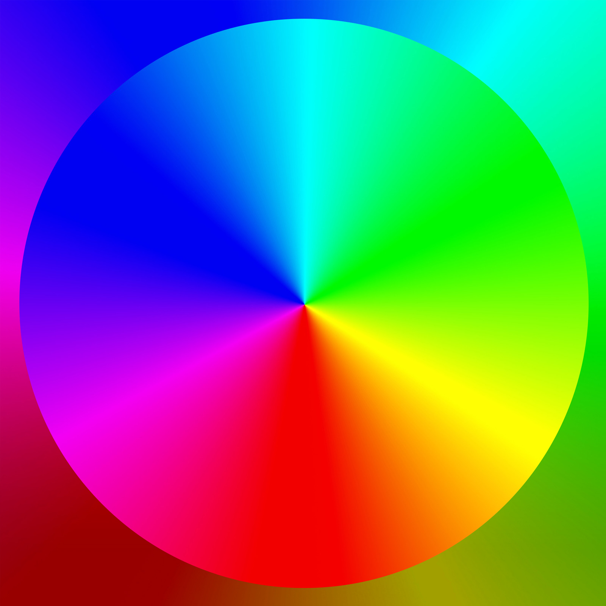
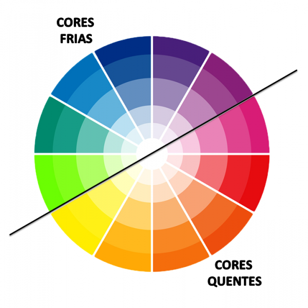
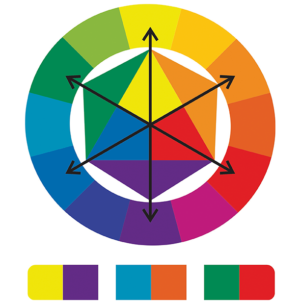

# CSS 3

CSS é a sigla de *Cascading Style Sheets* (Folhas de Estilo em Cascata, em tradução livre). Podem controlar o layout de várias páginas da web de uma só vez, através de classes.

> - CSS descreve como os elementos HTML devem ser exibidos na tela, no papel, ou em outra mídia. 
>
>   https://www.w3schools.com/css/css_intro.asp

```css
/* Configuração global do CSS */

* {

}

/* Compatibilidade */
@charset "UTF-8";
```


**Estilos de CSS**

- *Inline*: colocar o estilo dentro das tags. A problemática é a repetição de comandos, já que, quando fechar a tag, retornará ao padrão. Ou seja se, por exemplo, cada parágrafo colocar a mesma letra, deve repetir em todas as tags.

  ```html
  <p style="color:red">Olá mundo!</p>
  <p style="color:red">Este é um exemplo de estilização inline</p>
  ```

- CSS interno (*internal*) ou local: separação dos estilos para o conteúdo, o que torna mais fácil em trocar os estilos do que trocar um por um. Ideal apenas para um documento em HTML.

  ```html
  <style>
      p {
          color: red;
  	}
  </style>
  <p>Olá mundo!</p>
  <p>Este é um exemplo de estilização inline</p>
  ```

  (Onde color é a propriedade e red, estilização)

- CSS externo (*external*): criação de uma folha separada, que é aplicada no HTML com a tag `link: css`.

  ```html
  <head>
    <link rel="stylesheet" href="styles.css">
  </head>
  ```

  

  :exclamation: Pode utilizar dois links externos ou misturar técnicas em CSS.

**Harmonia das Cores**: É importante que a estilização das páginas tenha harmonia entre as cores. Para isso, o círculo cromático auxilia a compreensão desta harmonia.




​		:exclamation: Escolha da palheta de 3 a 5 cores (exceto preto e branco) para o seu site.

- Cores primárias: amarelo, azul, vermelho
- Cores secundárias: verde, laranja, violeta
- Cores terciárias: amarelo-esverdeado, amarelo-alaranjado, azul-esverdeado, azul-arroxeado, vermelho-alaranjado, vermelho arroxeado.

**Temperaturas de cores**: dividida em hemisférios frio e quente.




- Definições:

  

  - Cores complementares: cores que contrastam (extremo opostos)
  - Cores análogas: cores vizinhas
  - Cores análogas e uma complementar: suavização da cor principal com um contraste forte
  - Cores relacionadas: duas cores vizinhas, pula uma cor vizinha e escolhe a próxima cor
  - Cores intercaladas: escolha de uma cor e pula a vizinha para a escolha da próxima cor.
  - Cores triádicas: escolha de uma cor e pula três cores vizinhas seguidas para a escolha da próxima cor, o que forma um triângulo equilátero dentro do círculo cromático.
  - Cores em quadrado: escolha de uma cor, pula duas cores vizinhas para a próxima cor, gerando um quadrado. Utilizado para cores fortes e bem balanceadas.
  - Cores em tetrádicas: escolha de uma cor, sua complementar e outra cor e sua complementar, formando um retângulo. 
  - Monocromia: escolha de uma cor, alterando apenas a saturação e o brilho.

**Palheta de Cores**

​	Acessar `http://color.adobe.com` ou `http://paletton.com/coolors.co`

- Modos de cores

  - RGB (monitores)
  - CMYK (impressora)
  - HSV
  - LAB

  :exclamation: Hexadecimal (#000000)

  00 	00 	00
  <small>red	green	blue</small>

- Capturar cores: extensão ColorZilla

- Efeito degradê

  ```css
  /*Gradiente linear*/
  background-image: linear-gradient(to right, color1, color 2);
  								 /*pode ser por graus (deg)*/
  
  /*Gradiente radial*/
  background-image: radial-gradient(circle, color1, color 2);
  
  ```

  

**
